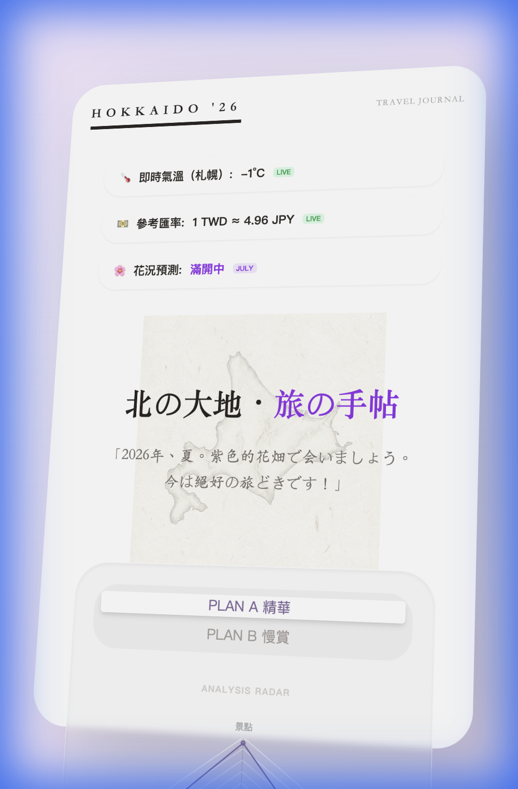

🏔️ 2026 北海道夏季自駕手帖 (Hokkaido Summer Trip Planner)

這是一個為 7 天北海道自駕旅程量身打造的互動式旅行手帖。專為 **iPhone Pro** 尺寸優化，結合了精緻的手繪視覺美學與即時旅遊數據資訊。



## ✨ 精選功能

- **📍 互動式行程系統**：
  - **7 天精確方案**：內容已根據 **JL508 班機** 與 **OTS 還車** 的實況流程全面優化。
  - **動態日切換**：流暢的日期切換體驗，支援 07/07 至 07/13 的完整紀錄。
- **📊 數據視覺化分析**：
  - **行程雷達圖 (Radar Chart)**：多維度分析行程平衡（景點、預算、購物等）。
  - **花況趨勢 (Bloom Line)**：即時視覺化 7 月薰衣草的花開預測曲線。
- **🌡️ 即時旅遊情報站**：整合多項即時 API 數據：
  - **札幌 live 氣溫**：定期同步最新氣象。
  - **匯率速算**：即時 TWD/JPY 參考匯率。
  - **夏季限定提示**：精選 7 月北海道哈密瓜與甜玉米的旬之味提醒。
- **📸 拍立得風格相簿**：每個行程點配備可橫向捲動的拍立得式照片牆，保留旅途記憶。
- **📝 質感 UI 元素**：
  - **客製化紙膠帶**：每一頁卡片皆配有代表北海道的 **薰衣草 (🪻)** 與 **哈密瓜 (🍈)** 裝飾貼紙。
  - **毛玻璃設計 (Glassmorphism)**：現代化的通透質感，搭配 Noto Serif JP 字體營造人文氣息。

## 📱 設備優化

本專案特別針對移動端（如 iPhone 17 Pro/Pro Max）進行排版優化，確保在窄螢幕下仍能擁有極佳的閱讀與操作體驗：
- **細膩字體**：選用 `Noto Serif JP` 與 `Klee One`。
- **手感設計**：精心計算的間距，讓單手滑動操作更加自然。

## 🛠️ 技術棧

- **前端**: React 19 + Vite 5
- **樣式**: Tailwind CSS v3
- **圖表**: Chart.js (`react-chartjs-2`)
- **佈署**: Zeabur (自動 CI/CD)

## 🚀 快速開始

1. **安裝依賴**:
   ```bash
   npm install
   ```
2. **啟動開發**:
   ```bash
   npm run dev
   ```

---
*「2026年、夏。北の大地へ。」專為這場完美的自駕旅程而生。❤️*
