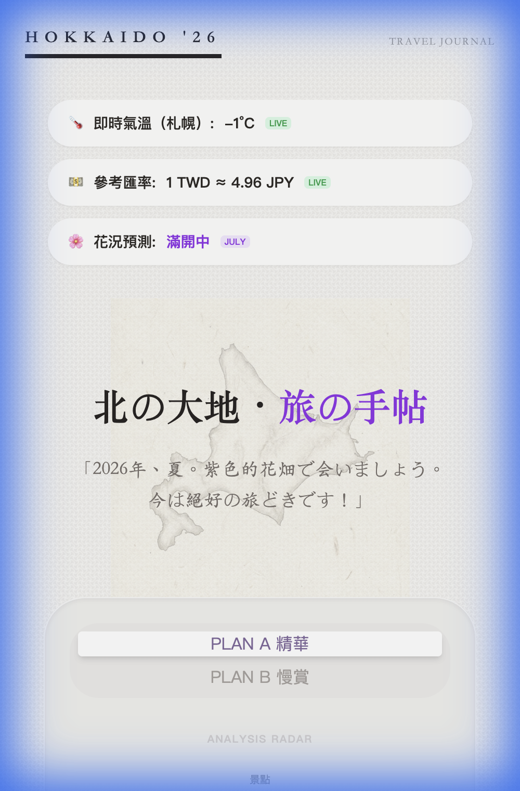

# 🏔️ 2026 北海道夏季自駕手帖 (Hokkaido Summer Trip Planner)

這是一個為 7 天北海道自駕旅程量身打造的高級互動式旅行手帖。專為 **iPhone 17 Pro** 的行動端體驗優化，結合了手繪美學與即時旅遊資訊。



## ✨ 精選功能

- **📍 互動式行程時間軸**：採用 Wabi-sabi 紙質美學與手繪風格，並設有會隨捲動進度同步移動的「導航小車」動畫，完美呈現自駕旅程的動態感。
- **🌡️ 即時旅遊情報站**：整合多項即時數據 API，包含：
  - **札幌即時氣溫**：串接 Open-Meteo API 取得現地氣溫。
  - **匯率速算**：即時匯率串接，呈現最新的 TWD 與 JPY 參考比例。
  - **花況預報**：模擬 7 月薰衣草季的「滿開」即時狀態。
- **📊 多元方案切換**：搭載動態 **PLAN A (精華版)** 與 **PLAN B (慢賞版)** 切換功能，圖表（Radar 與 Bloom Line Chart）會隨之即時反應。
- **📝 手寫質感清單**：精緻的紙帶（Washi Tape）樣式卡片，搭配可勾選的待辦功能。

## 📱 行動端優化 (iPhone 17 Pro)

針對 **iPhone 17 Pro** (402x874 解析度) 深度優化，提供極致的視覺饗宴：
- **毛玻璃效果 (Glassmorphism)** 的實用資訊欄。
- **精心挑選的字體**：使用了 Noto Serif JP 與 Klee One 營造人文手感。
- **響應式間距**：專為垂直滑動體驗設計的超大間距，讓小車動畫更具故事性。

## 🌐 線上佈署 (Zeabur)

本專案已支援 **Zeabur** 自動化佈署。只要推送到 GitHub，系統將自動進行編譯與上線。
- **佈署網址教學**：請參閱 [DEPLOYMENT.md](./DEPLOYMENT.md) 了解如何綁定網域與自動更新設定。

## 📊 視覺化分析
- **雷達圖 (Analysis Radar)**：精確呈現行程方案在「景點、餘裕、購物、效率、預算」五大維度的權衡。
- **花況曲線 (Bloom Forecast)**：根據 2026 年預測數據呈現薰衣草的生長曲線。
- *註：圖表均已針對行動端優化，確保在各種比例下維持完美形狀。*

## 🛠️ 技術棧

- **框架**: React 19 + Vite 5
- **樣式**: Tailwind CSS v3 (精確控制每一點間距)
- **視覺化**: Chart.js (`react-chartjs-2`)
- **佈署**: Zeabur (CI/CD 自動化)

## 🚀 快速上手

1. **複製儲存庫**:
   ```bash
   git clone https://github.com/lawrence555-dev/Hokkaido_Summer_Trip_Planner.git
   ```
2. **安裝依賴**:
   ```bash
   npm install
   ```
3. **啟動開發伺服器**:
   ```bash
   npm run dev
   ```

## 📸 操作預覽


---
*專為 2026 年夏季的紫色北海道之旅精心設計。❤️*
